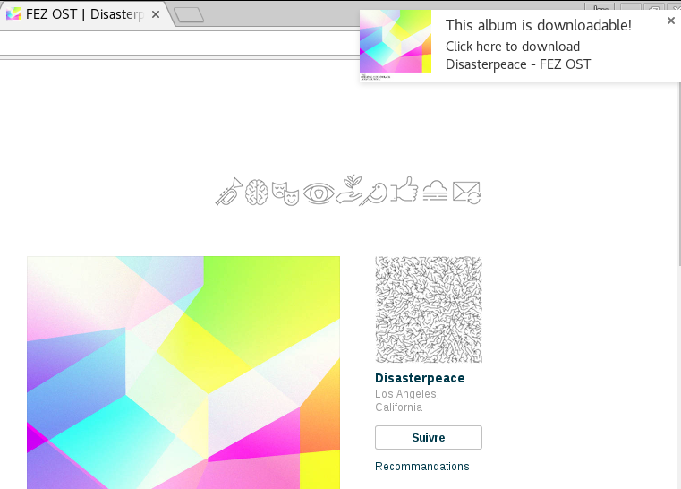
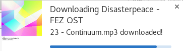
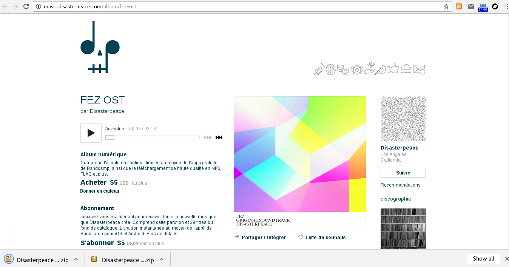
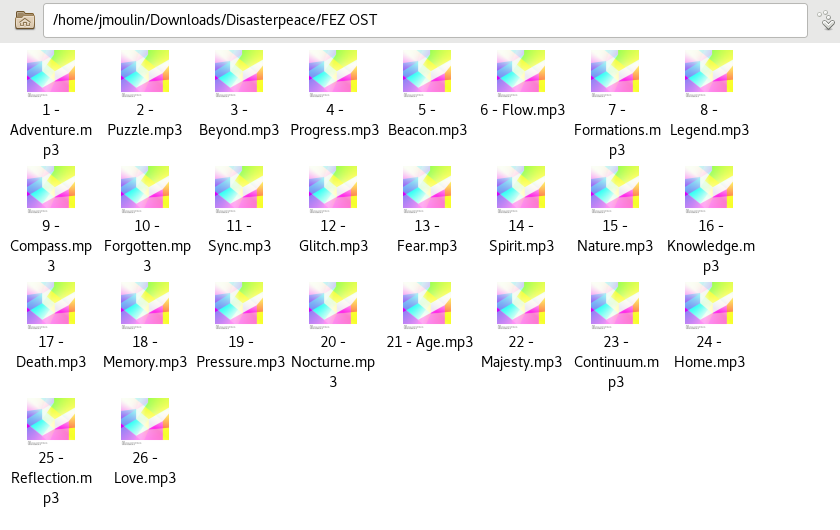
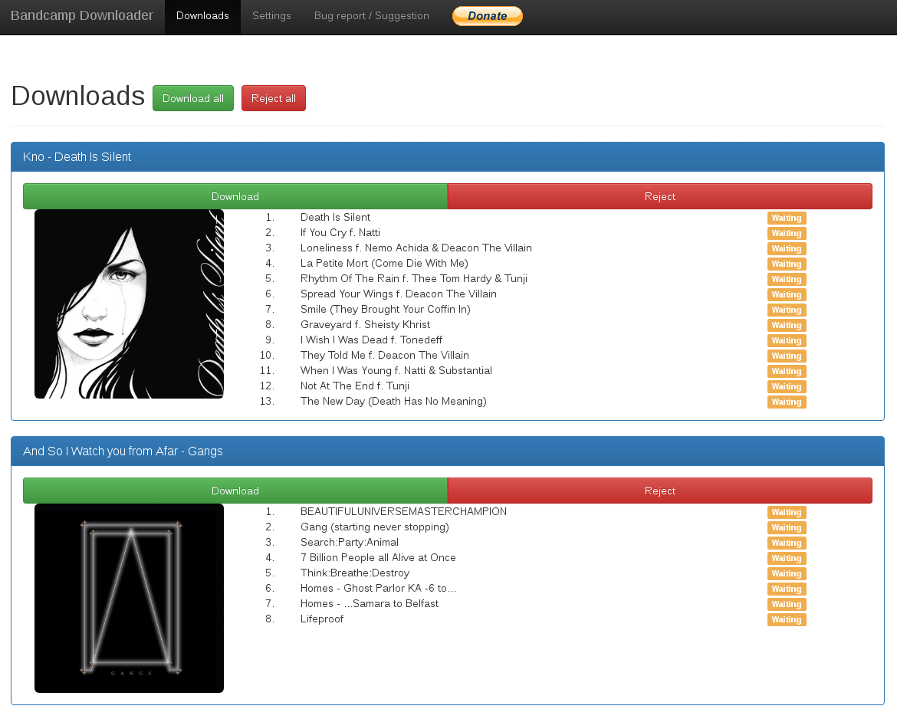
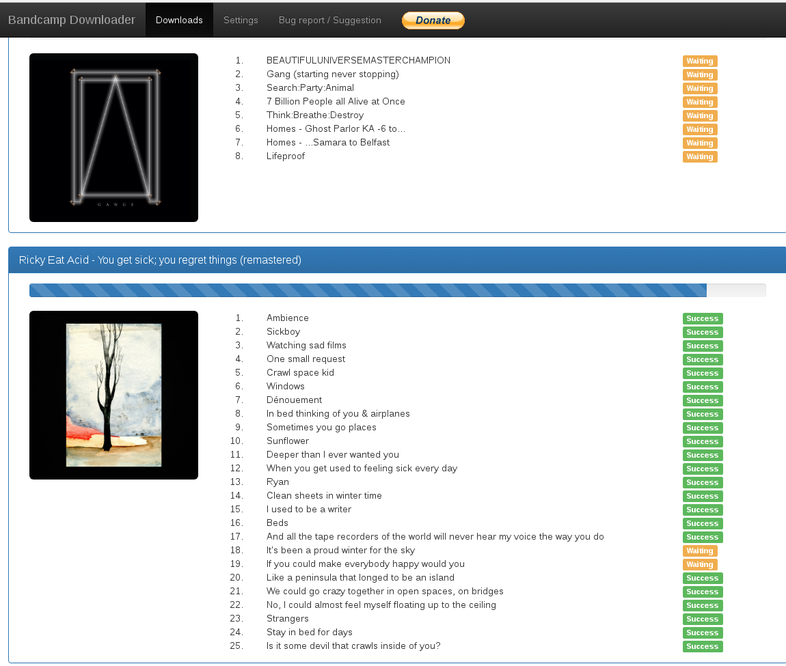
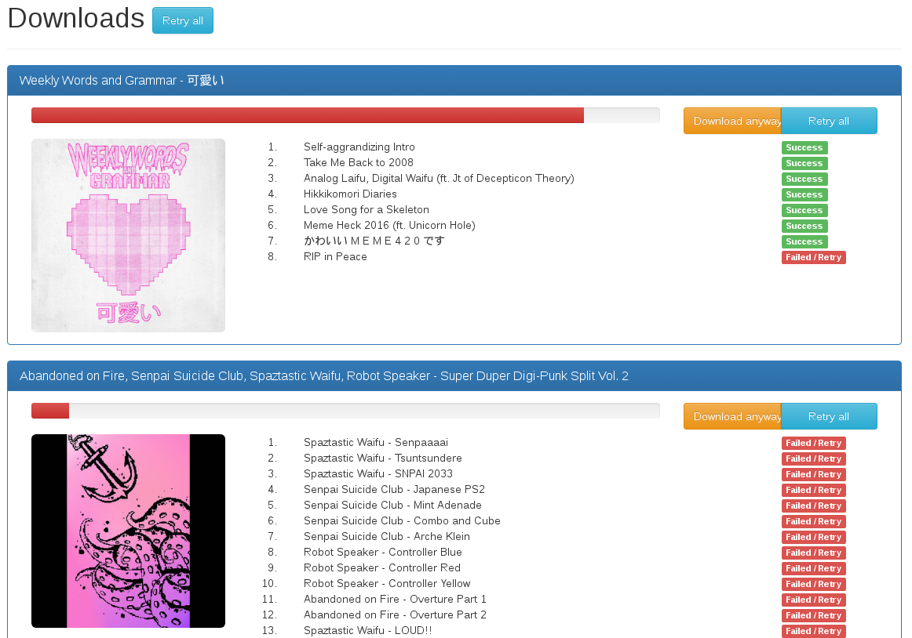

Bandcamp Dowloader
==

This Google Chrome extension allows you to easily download albums you can listen on Bandcamp.

Bug report and suggestions are welcome on this URL : [https://github.com/jaymoulin/bandcamp-down-chrome-ext/issues](https://github.com/jaymoulin/bandcamp-down-chrome-ext/issues).

Developpers are also welcome to contribute by forking and PR-ing at this URL : [https://github.com/jaymoulin/bandcamp-down-chrome-ext/pulls](https://github.com/jaymoulin/bandcamp-down-chrome-ext/pulls)

## What it looks like

when you visit a bandcamp page with a listenable album, a notification will appear to download the album :

Just click on it to download the album

## Update 0.3.0

You can now configure the extension with the notification you want to see.

Also, a new download page allows you to download multiple albums at the same time and retry tracks that failed to download.
This page offers you really cool options to ease album downloading !
 
 ## Update 0.4.0
 
 You can now download full artist discography and auto start download!
 
 
 
 
 
 
 
 
